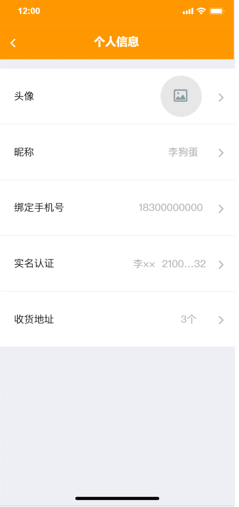
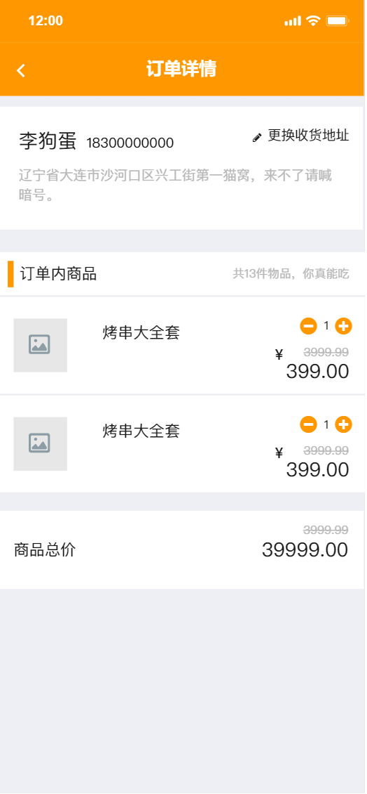
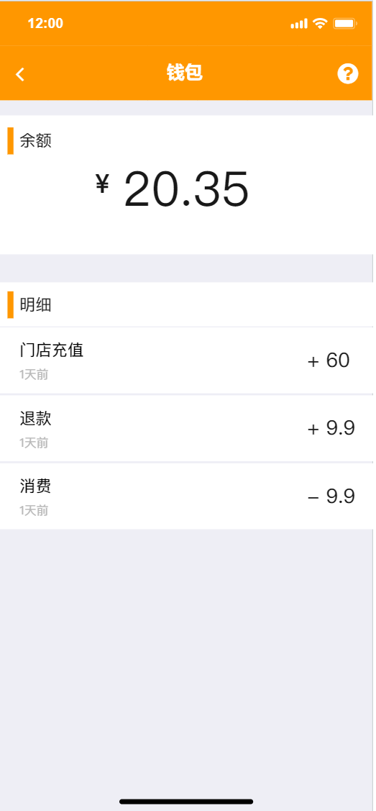
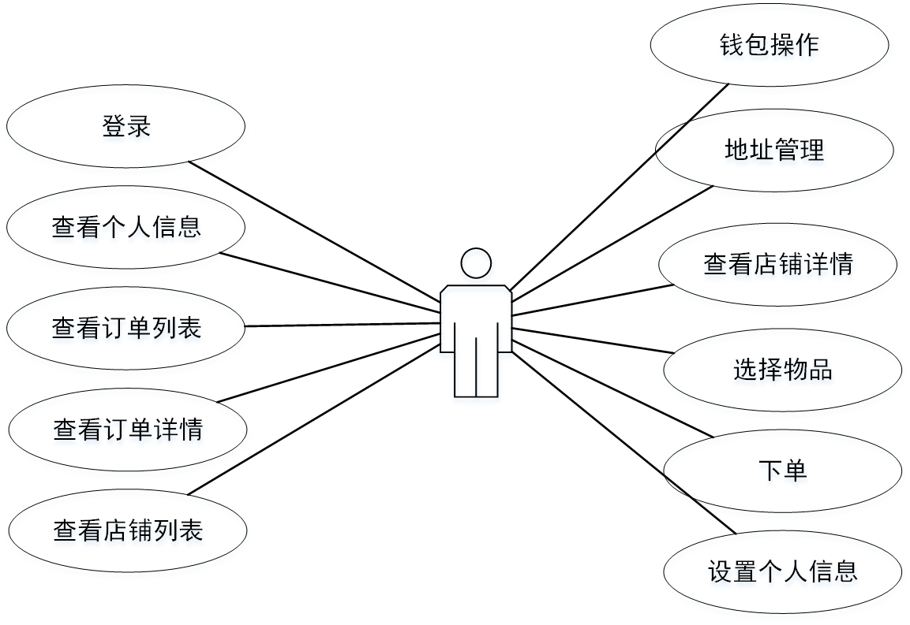
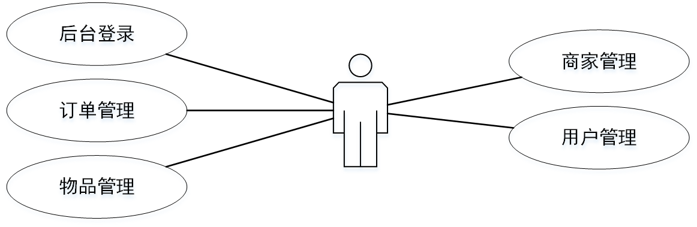

## 3.3 系统功能设计

这一部分将对每的系统功能进行详细设计，并绘制原型图。 这一部分已经包含了原型图设计和 UI 设计。

绘制原型图使用优秀的设计工具 “墨刀 ”。

> 图1 点餐界面

> 图2 个人信息修改页面

> 图3 创建订单页面

> 图4 钱包页面

### 3.3.1 登录

进入首页时会检查是否存在登录信息，如果不存在登录信息则会提示用户登录。输入用户名和密码后会显示给用户loading样式，登录后从后端接口获取登录凭证（token）。

### 3.3.2 首页查看个人信息

登录后进入首页，页面加载完成后会向后端请求个人信息。个人信息包括昵称、头像，用户id、钱包余额。

### 3.3.3 首页查看订单列表

加载个人信息的同时还会向后端请求获取订单列表，会获取当前用户的全部订单，按创建订单时间倒序排序。后续如果数据量增加，还会加入分页功能。

### 3.3.4 查看订单详情

点击单个订单可前往订单详情页，在订单详情页可以回去到订单的基本信息（下单人，下单时间，订单地址，订单价格）和订单所包含的物品列表。

### 3.3.5 查看店铺列表

会显示全部已存在的的店铺列表。如果后续数据量增大，会加入分页功能。

### 3.3.6 查看店铺详情

点击单个店铺可进入店铺详情页，在详情页可以查看到店铺的详细信息，包括店铺名字、店铺公告等。

### 3.3.7 查看店铺下物品列表

物品列表和店铺详情同时加载，会显示在同一个页面下。物品列表包含物品的名字、物品简介和物品价格。

### 3.3.8 选择物品

在物品列表点击物品名称下方加减号可以选择要购买的物品数量。

### 3.3.9  下单

选好物品后点击下单可以预览订单，在预览页面可以在预先配置好的地址列表中选择一个收货地址。下单页面还会显示选择好的物品列表和对应的物品数量。点击下单按钮会正式从帐号余额扣款，并创建订单。创建好的订单可以在首页看到。

### 3.3.10 设置个人信息

在首页点击个人信息卡片可以进入个人信息设置页。个人信息可以设置昵称和头像。

### 3.3.11 钱包操作

在钱包页面可以查看自己的余额。充值需要前往门店，通过付款后管理员增加余额的方式来进行充值。提现操作可以在线上进行，发起提现请求，管理员审核后将钱款打向预留的账户。

### 3.3.12 地址管理

在个人信息修改页面可以进入地址管理页，可以新增收货地址或删除已经存在的地址。添加好的地址会在创建订单页面显示。

### 3.3.13 后台登录

进入后台首页会检查登录状态，如果没有登录状态则会跳转到登录页，有登录状态下则会进入系统首页。

### 3.3.14 后台-订单管理

可以查看全部订单列表，相关管理功能后期拟开发。

### 3.3.15 后台-物品管理

可以查看全部的物品列表，也可以增加新的物品。新增物品时可以选择新的物品属于哪个门店，并指定物品名称、物品描述、物品价格。可以对物品名称、物品价格、物品描述进行编辑。当然也可以直接删除物品。

### 3.3.16 后台-商家管理

可以查看全部的商家列表，可以编辑商家名称和商家简介，也可以删除商家。

### 3.3.17 后台-用户管理

可以以列表的形式查看全部存在的用户，可以编辑用户的昵称。由于没有开发“审核提现申请”的功能，所以在用户管理中增加了可以修改用户余额的功能来满足充值和提现的需求。

### 3.3.18 注销登录

无论是后台还是APP端，都具有注销登录功能。清除当前用户登录凭证，并退到登录页面。

## 3.4 用户用例图

> 图：用户用例图

> 图：后台管理员用例图