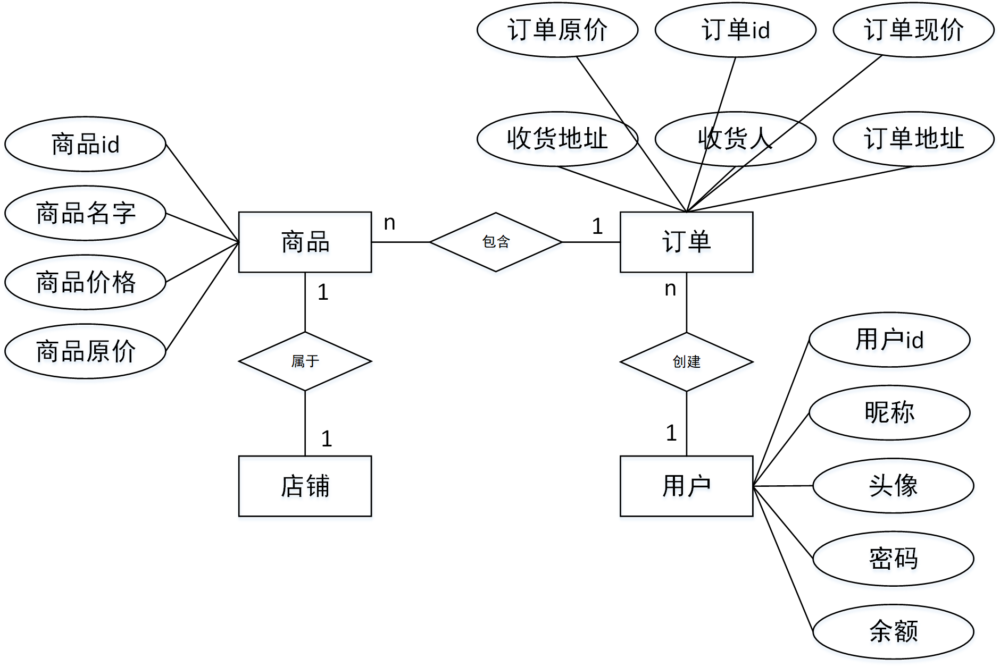

# 第5章 数据库设计

## 5.1 概念结构设计

在本节我们使用E-R 图来进行数据库的初步设计。E-R 图只表示实体-属性之间的关系，和实体间的联系，无关于DBMS。依照E-R 图可以在任意DBMS 下建立表结构。



> 图：系统E-R图

## 5.2 逻辑结构设计

在本节，我们要将E-R 图中表示的实体-关系之间的联系转换为关系模式，并在关系模式下确定主键和外键的关系。

在E-R 图中的用户部分，涉及了用户的基本属性。用于与订单产生联系，订单与商品产生联系。四个实体之间是一条线的关系。

整个数据库的逻辑结构如下。


用户（用户id，昵称，头像，密码，余额）

主键：用户id


订单（订单id，创建人id，订单地址，收货人，订单现价，订单原价）

主键：订单id；外键：创建人id


店铺（店铺id，店铺名字，店铺简介）

主键：店铺id


商品（商品id，店铺id，商品名字，商品价格，订单）

主键：商品id；外键：店铺id


商品-订单（商品订单id，商品id，订单id）

主键：商品订单id；外键：商品id，订单id


上述逻辑关系可以用下图来表示。


## 5.3 数据库的物理实现

在数据库的物理实现上，我们将从 DBMS的选择开始，直到每一个数据表都建成。根据前两节的概念及逻辑结构设计，已经得到了数库无关于DBMS的设计方案，在这一节我们将前文所述落实到际的DBMS上，进行更详细的设计。

在 DBMS上，我们选择 MySQL，配合 原生的PHP MySQL 扩展可以发挥其最大的优势。

创建数据表 user，用于存储户信息。其中 id 是主键，为用户表的索引行。 同时也是唯一字段，为查询提供索引。

执行如下语句来创建user表。

```sql
CREATE TABLE `user` (
  `id` int(11) NOT NULL AUTO_INCREMENT,
  `usr` varchar(255) COLLATE utf8_unicode_ci DEFAULT NULL,
  `pwd` varchar(255) COLLATE utf8_unicode_ci DEFAULT NULL,
  `valid` int(1) DEFAULT '1',
  `create_at` datetime DEFAULT NULL,
  `update_at` datetime DEFAULT NULL,
  `nickname` varchar(255) COLLATE utf8_unicode_ci DEFAULT NULL,
  `icon` varchar(255) COLLATE utf8_unicode_ci DEFAULT NULL,
  `type` varchar(10) COLLATE utf8_unicode_ci DEFAULT '1',
  `restMoney` float(10,2) DEFAULT NULL,
  PRIMARY KEY (`id`)
) ENGINE=InnoDB AUTO_INCREMENT=2 DEFAULT CHARSET=utf8 COLLATE=utf8_unicode_ci;
```


创建数据表token，用于存储用户的登录凭证。其中id是主键，userid是外键，为user表中的id。执行下面的语句来创建token表。

```sql
CREATE TABLE `token` (
  `id` int(11) NOT NULL AUTO_INCREMENT,
  `token` varchar(255) COLLATE utf8_unicode_ci NOT NULL,
  `userid` int(11) NOT NULL,
  `die_at` datetime DEFAULT NULL,
  `create_at` datetime DEFAULT NULL,
  `valid` int(1) DEFAULT '1',
  PRIMARY KEY (`id`,`token`,`userid`)
) ENGINE=InnoDB AUTO_INCREMENT=25 DEFAULT CHARSET=utf8 COLLATE=utf8_unicode_ci;
```


创建user_addr表，用于存放用户的地址信息。其中id是主键，userid是外键。

```sql
CREATE TABLE `user_addr` (
  `id` int(11) NOT NULL AUTO_INCREMENT,
  `userid` int(11) NOT NULL,
  `addr` varchar(255) COLLATE utf8_unicode_ci DEFAULT NULL,
  `name` varchar(255) COLLATE utf8_unicode_ci DEFAULT NULL,
  `phone` varchar(255) COLLATE utf8_unicode_ci DEFAULT NULL,
  `valid` int(1) DEFAULT '1',
  `create_at` datetime DEFAULT NULL,
  PRIMARY KEY (`id`,`userid`)
) ENGINE=InnoDB AUTO_INCREMENT=3 DEFAULT CHARSET=utf8 COLLATE=utf8_unicode_ci;
```


创建shop表，用于存放店铺的相关信息。其中id是主键。

```sql
CREATE TABLE `shop` (
  `id` int(11) NOT NULL AUTO_INCREMENT,
  `name` varchar(255) COLLATE utf8_unicode_ci DEFAULT NULL,
  `create_at` datetime DEFAULT NULL,
  `valid` int(1) DEFAULT '1',
  `notice` varchar(255) COLLATE utf8_unicode_ci DEFAULT NULL,
  PRIMARY KEY (`id`)
) ENGINE=InnoDB AUTO_INCREMENT=6 DEFAULT CHARSET=utf8 COLLATE=utf8_unicode_ci;
```


创建goods表，用于存放商品信息。其中id是主键。

```sql
CREATE TABLE `goods` (
  `id` int(11) NOT NULL AUTO_INCREMENT,
  `shopId` int(11) DEFAULT NULL,
  `name` varchar(255) COLLATE utf8_unicode_ci DEFAULT NULL,
  `describe` varchar(255) COLLATE utf8_unicode_ci DEFAULT NULL,
  `create_at` datetime DEFAULT NULL,
  `price` decimal(10,2) DEFAULT NULL,
  `image` varchar(255) COLLATE utf8_unicode_ci DEFAULT NULL,
  `valid` int(1) DEFAULT '1',
  PRIMARY KEY (`id`)
) ENGINE=InnoDB AUTO_INCREMENT=13 DEFAULT CHARSET=utf8 COLLATE=utf8_unicode_ci;
```


创建order表，用于存放订单信息。其中id是主键，userid是外键。

```sql
CREATE TABLE `order` (
  `id` varchar(32) COLLATE utf8_unicode_ci NOT NULL,
  `userid` int(11) NOT NULL,
  `create_at` datetime DEFAULT NULL,
  `ori_price` decimal(10,2) DEFAULT NULL,
  `price` decimal(10,2) DEFAULT NULL,
  `name` varchar(255) COLLATE utf8_unicode_ci DEFAULT NULL,
  `phone` varchar(255) COLLATE utf8_unicode_ci DEFAULT NULL,
  `addr` varchar(255) COLLATE utf8_unicode_ci DEFAULT NULL,
  `valid` int(1) DEFAULT '1',
  `status` int(1) DEFAULT '1',
  PRIMARY KEY (`id`,`userid`)
) ENGINE=InnoDB DEFAULT CHARSET=utf8 COLLATE=utf8_unicode_ci;
```


创建order_goods表，用于存放订单-商品信息。其中id是主键，orderId、goodId是外键，分别是订单id和商品id。

```sql
CREATE TABLE `order_goods` (
  `id` int(11) NOT NULL AUTO_INCREMENT,
  `orderId` varchar(255) COLLATE utf8_unicode_ci DEFAULT NULL,
  `goodId` int(11) DEFAULT NULL,
  `create_at` datetime DEFAULT NULL,
  `ori_price` decimal(10,2) DEFAULT NULL,
  `price` decimal(10,2) DEFAULT NULL,
  `valid` int(1) DEFAULT '1',
  PRIMARY KEY (`id`)
) ENGINE=InnoDB AUTO_INCREMENT=8 DEFAULT CHARSET=utf8 COLLATE=utf8_unicode_ci;
```


创建goods_price_control表，用于额外控制商品价格。这个机制的具体设计思路会在后边详细描述。表中id是主键，goodId是外键。

```sql
CREATE TABLE `good_price_control` (
  `id` int(11) NOT NULL AUTO_INCREMENT,
  `goodId` int(11) NOT NULL,
  `begin_at` datetime DEFAULT NULL,
  `end_at` datetime DEFAULT NULL,
  `valid` int(1) DEFAULT '1',
  `price` decimal(10,2) DEFAULT NULL,
  `type` int(1) DEFAULT '1',
  `incOrDec` int(1) DEFAULT NULL,
  PRIMARY KEY (`id`,`goodId`)
) ENGINE=InnoDB AUTO_INCREMENT=2 DEFAULT CHARSET=utf8 COLLATE=utf8_unicode_ci;
```


创建money_log表，用于存放用于余额变动的记录。其中id是主键，userid是外键。

```sql
CREATE TABLE `money_log` (
  `id` int(11) NOT NULL AUTO_INCREMENT,
  `userid` int(11) NOT NULL,
  `money` float(10,2) DEFAULT NULL,
  `afterChange` float(10,2) DEFAULT NULL,
  `create_at` datetime DEFAULT NULL,
  `reason` varchar(255) COLLATE utf8_unicode_ci DEFAULT NULL,
  `valid` int(1) DEFAULT '1',
  PRIMARY KEY (`id`,`userid`)
) ENGINE=InnoDB AUTO_INCREMENT=5 DEFAULT CHARSET=utf8 COLLATE=utf8_unicode_ci;
```

