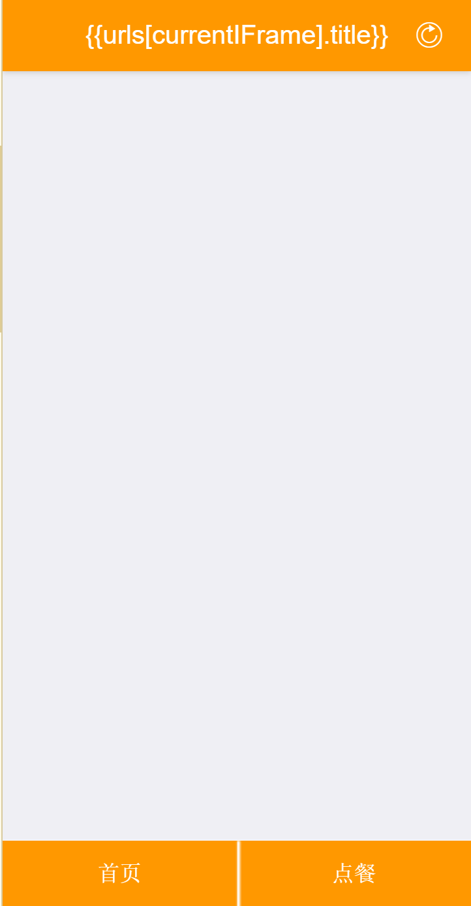
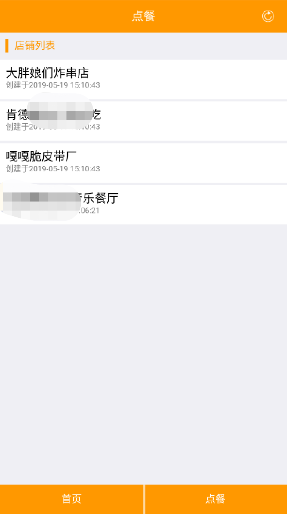
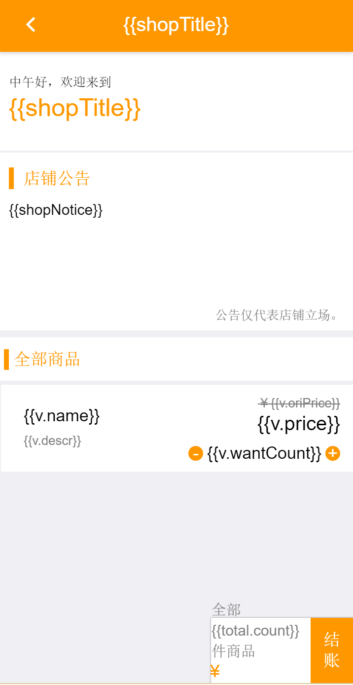
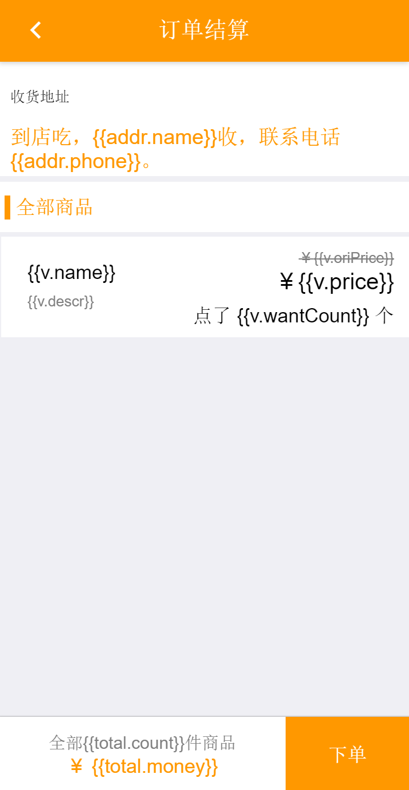
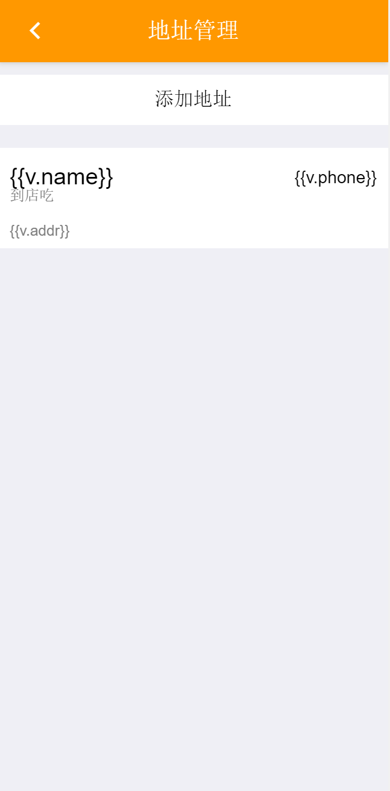

## 6.3 app端前端页面与逻辑

本节将会从各个细节描述app端的实现方式。每个页面分为设计部分与逻辑部分。

### 6.3.1 登录与登录凭证保存

由于web app使用html5+的环境，故可以使用`plus.storage`相关的底层接口来操作本地存储。登录凭证通过登录接口获取，获取到的登录凭证就存放在本地存储`plus.storage`中。在登录页面我们可以看到这样的逻辑：

```javascript
//more code...
if(res.code == 0){
    for(var i in res.data){
        plus.storage.setItem(i,res.data[i]);
    }
//more code...
```

这样，登录接口所返回的个人信息数据就全部存储到了本地存储`localStorage`中了。当需要使用的时候，可以使用

```javascript
var token = plus.storage.getItem('token');
```

来获取。

### 6.3.2 标题和导航

在设计App的结构时，最先要设计标题和导航的逻辑。顶部的标题栏和底部的导航栏是整个App的外框，其他页面都在中间的位置来加载。当加载第二级页面的时候，再将导航栏和标题栏覆盖。上面描述的就是整个App的外框结构。

标题栏使用mui框架自带的`mHeader`组件，我们使用css对其进行适当改造。

```html
<header class="mui-bar mui-bar-nav xt-title">
    <h1 class="mui-title">{{urls[currentIFrame].title}}</h1>
    <a class="mui-icon mui-icon-refresh mui-pull-right" @click="refresh"></a>
</header>
```

```css
.xt-title{
	position: fixed;
	width: 100%;
	background-color: #FF9800;
	height: 55px;
	z-index: 1000000;
}

.xt-title>h1{
	color: white;
	height: 55px;
	line-height: 55px;
	font-size: 20px;
	text-align: center;
}

.xt-title>a{
	color: white;
	height: 55px;
	line-height: 55px;
	display: flex;
	flex-direction: column;
	justify-content: center;
}
```

实现的效果是



在描述导航栏的逻辑之前，需要先讲到Vue.js框架，因为我们需要使用vue来渲染导航栏的内容和导航栏的点击事件。

在vue的data中，需要存放如下几个数据对象

```javascript
//刚进入页面要加载的webview
urls: [
    {
        title: '一个像美团一样的点餐App',
        url: 'mine.html',
        display: 'none'
    },
    {
        title: '点餐',
        url: 'storeList.html',
        display: ''
    }
],

webviews:[],

//当前webview
currentIFrame: 0
```

在页面加载完成事件`mounted`中，除了检查token之外，还需要加载一系列的webview。需要加载的webview列表就是`data.urls`数组。在App启动的时候，先加载好需要显示的页面，在点击导航栏的时候只需要控制是否显示。如果是点击导航栏才加载页面，会导致卡顿，体验极差。

对加载webview的实现方式是

```javascript
var _this = this;
for(var i in _this.urls){
    var C = plus.webview.create(_this.urls[i].url,_this.urls[i].url,{
        top: '55px',
        bottom: '50px'
    });

    plus.webview.currentWebview().append(C);
}

plus.webview.getWebviewById(_this.urls[_this.currentIFrame].url).show();
```

在`methods`对象中有这样一个方法，用来切换导航。

```javascript
switchPage(index){
    var _this = this;
    for(var i in _this.urls){
        plus.webview.getWebviewById(_this.urls[i].url).hide();
    }

    plus.webview.getWebviewById(_this.urls[index].url).show();
    _this.currentIFrame = index;
}
```

将这个方法绑定到每个导航按钮上，就可以实现导航栏切换页面了。例如

```vue
<div class="nav-item" @click="switchPage(0);">首页</div>
```

上述逻辑与页面都完成后，进入App的页面如下。


搭建好了导航和标题之后，所有一级页面都只需要嵌在这个外框中即可。需要二级页面的时候，使用5+提供的`plus.webview`接口即可创建新的webview，覆盖在外框上即可。

### 6.3.3 用户首页和订单列表

用户首页的实现结果如上图所示，这个页面分为个人信息和订单列表两个部分。两部分的数据分别使用ajax获取。每个需要绑定的数据项都写在vue的data中，在ajax之后将数据对应存入即可。

vue的data对象初始状态是

```javascript
morning: '..好',
icon: '',
nickname: '...',
restMoney: '...',
orderList: []
```

获取用户信息的逻辑是

```javascript
getUserInfo(){
    var _this = this;
    ajax('user',{
        token: plus.storage.getItem('token'),
        method: 'getUserInfo',
        field: 'nickname,icon,restMoney'
    },function(res){
        vd(res);
        if(res.code == 0){
            _this.restMoney = res.data.restMoney;
            _this.nickname = res.data.nickname;
            _this.icon = res.data.icon == null?null:{'background-image':'url('+ res.data.icon +')'};
        }else{
            alert(res.msg);
        }
    });
}
```

获取订单列表的逻辑是

```javascript
getOrderList(){
    var _this = this;
    ajax('order',{
        method: 'listMyOrder',
        token: plus.storage.getItem('token')
    },function(res){
        if(res.code == 0){
            var orderList = [];
            for(var i in res.data){
                res.data[i].goodName = res.data[i].goods[0].name;
                orderList.push(res.data[i]);
            }

            _this.orderList = orderList;
        }else{
            alert(res.msg);
        }
    });
}
```

在页面加载事件`mounted`中，需要启动上面两个逻辑。

```javascript
this.getUserInfo();
this.getOrderList();
```

这样就获取到了页面初始化的数据。

点击订单项时需要跳转到订单详情，需要向订单详情页传入订单id。订单列表项的`@click`事件是

```vue
<div class="orderList" v-for="(v,k) in orderList" @click="jumpToDetailPage(v.id)">
```

对应的`jumpToDetailPage`逻辑是

```javascript
jumpToDetailPage(orderId){
    plus.webview.create('orderDetail.html','orderDetail.html',{},{
        orderId: orderId
    }).show('slide-in-right');
}
```

稍后在订单详情页的描述中会讲述如何获取这个`orderId`。

### 6.3.4 店铺列表

店铺列表的获取方式与订单列表的获取方式相同，使用ajax获取数据，放在vue的data中，使用vue渲染到页面上。实现结果是



### 6.3.5 店铺详情和物品列表

店铺详情和物品列表在同一个页面中，使用两个接口分别获取。店铺详情包括店铺名称和店铺简介。获取到的商品列表要可以选择数量，从而直接创建订单。

由于对每个商品都要选择数量，所以商品列表的data对象和之前的列表都不同，首先我们先看获取商品列表的逻辑。

```javascript
getGoodsList(){
    var _this = this;
    ajax('goods',{
        method: 'listGoods',
        shopId: _this.shopId,
    },function(res){
        if(res.code == 0){
            for(var i in res.data){
                _this.goodList.push({
                    goodId: res.data[i].id,
                    name: res.data[i].name,
                    descr: res.data[i].describe,
                    price: (res.data[i].newPrice == null)?res.data[i].price:res.data[i].newPrice,
                    oriPrice: res.data[i].price,
                    wantCount: 0
                });
            }

            console.log(JSON.stringify(_this.goodList))
        }else{
            alert('获取物品列表时出现错误：' + res.msg);
        }
    });
}
```

`price`和`oriPrice`是原价和现价，显示在页面上是为了有划线价格的效果。`wantCount`是想要的数量，用于实现点餐效果。

页面被渲染之前的样子是



商品选择的加减号的样式是

```html
<div class="count">
    <div class="dis" @click="wantLess(k)">-</div>
    <div class="number">{{v.wantCount}}</div>
    <div class="add" @click="wantMore(k)">+</div>
</div>
```

点击减号会减少对应的数量，点击加号会增加对应的数量，加减的逻辑实现方式是

```javascript
wantMore(goodId){
    this.goodList[goodId].wantCount ++;
    plus.nativeUI.toast(this.goodList[goodId].name + '，' + this.goodList[goodId].descr);
}
```

```javascript
wantLess(goodId){
    if(this.goodList[goodId].wantCount != 0){
        this.goodList[goodId].wantCount --;
        plus.nativeUI.toast('你失去了' + this.goodList[goodId].descr);
    }
}
```

点击结账之后会将物品列表和想要的数量整理为一个json字符串，传入创建订单页面。页面跳转逻辑是

```javascript
plus.webview.create('createOrder.html','createOrder.html',{},{
    goodList: JSON.stringify(_this.goodList)
}).show('slide-in-right');
```

### 6.3.6 创建订单

创建订单页面初始化成功后，会获取上一个webview传入的物品列表和价格信息并显示给用户。同时获取当前用户保存的地址信息，并可以选择其他地址。创建订单页面的实现结果是



由于全部商品数和金额总数需要通过计算商品列表的价格来得出，所以这个页面需要用到vue的`computed`属性。计算total的逻辑是

```javascript
computed: {
    total(){
        var _this = this;
        var _total = {
            count: 0,
            money: 0
        };

        for(var i in _this.goodList){
            if(_this.goodList[i].wantCount > 0){
                _total.count += _this.goodList[i].wantCount;
                _total.money += _this.goodList[i].wantCount * _this.goodList[i].price;
            }
        }

        return _total;
    }
}
```

由于下单按钮在屏幕底部，会挡到商品列表，所以当商品列表满一页的时候，下单按钮的一条会整体上移。这个逻辑的实现方式是

```javascript
window.onscroll = function(e){
    var a = document.documentElement.scrollTop || document.body.scrollTop;//滚动条y轴上的距离
    var c = document.getElementById('total');
    if(a > 320){
        c.style.removeProperty('bottom');
        c.style.top = '66px';
    }else if(a <= 320){
        c.style.removeProperty('top');
        c.style.bottom = '2vh';
    }
}
```

当点击下单，会将物品列表整理成后端接口所规定的格式，通过ajax的方式发送到后端。

```javascript
createOrder(){
    var _this = this;
    var goodsIdArr = [];
    for(var i = 0; i < _this.goodList.length; i ++){
        if(_this.goodList[i].wantCount > 0){
            goodsIdArr.push(_this.goodList[i].goodId);
        }
    }
    var goodsIdStr = goodsIdArr.join(',');

    ajax('order',{
        method: 'createOrder',
        token: plus.storage.getItem('token'),
        goodsList: goodsIdStr,
        name: _this.addr.name,
        phone: _this.addr.phone,
        addr: _this.addr.addr
    },function(res){
        if(res.code == 0){
            alert('下单成功，已自动扣款。请返回首页查看订单。');
            plus.webview.getWebviewById('storeHomePage.html').close();
            plus.webview.currentWebview().close();
        }else{
            alert(res.msg);
        }
    });
}
```

### 6.3.7 用户信息修改

用户修改信息只支持修改头像和昵称，当想要修改其他字段内容的时候，系统会给出提示。修改用户信息的逻辑实现是

```javascript
updateUserinfo(key){
    var _this = this;
    if(key == 'nickname'){
        var newNickname = prompt('请输入新的昵称');
        if(newNickname){
            ajax('user',{
                token: plus.storage.getItem('token'),
                method: 'setUserInfo',
                key: 'nickname',
                value: newNickname
            },function(res){
                if(res.code == 0){
                    alert('修改昵称成功');
                    _this.nickname = newNickname;
                    plus.webview.getLaunchWebview().reload();
                }else{
                    alert(res.msg);
                }
            });
        }
    }else if(key == 'icon'){
        document.getElementById('imageChoose').click();
        document.getElementById('imageChoose').addEventListener('change',function(e){
            var form = new FormData();
            form.append('file',document.getElementById('imageChoose').files[0]);
            var xhr = new XMLHttpRequest();
            xhr.open("post", 'http://xtzero.me/dressupAsMeituan/api/upload.php?method=uploadImage', true);

            xhr.onload = function(res){
                //这个值就是ajax返回的数据
                var xxx = JSON.parse(res.currentTarget.response);
                if(xxx.code == 0){
                    var imageUrl = 'http://xtzero.me/dressupAsMeituan/api/' + xxx.data.filename;
                    ajax('user',{
                        token: plus.storage.getItem('token'),
                        method: 'setUserInfo',
                        key: 'icon',
                        value: imageUrl
                    },function(res){
                        if(res.code == 0){
                            alert('修改头像成功');
                            plus.webview.getLaunchWebview().reload();
                            plus.webview.currentWebview().reload();
                        }else{
                            alert(res.msg);
                        }
                    });
                }else{
                    alert(xxx.msg)
                }
            }

            xhr.onerror = function(){
                alert('上传失败，请稍后重试');
            }

            xhr.send(form);
        })
    }else{
        alert('这项不提供修改');
    }
```

当要修改的信息是头像时，会调用系统的文件选择器来让用户选择头像。选择图片之后会通过接口将图片传到服务器，并将返回的地址发送给修改用户信息接口。

### 6.3.8 订单详情

打开订单详情页时，会先使用

```javascript
var orderId = plus.webview.currentWebview().orderId;
```

来从上一个页面获取传入的订单id。如果判断没有订单id，则会提示错误。

```javascript
if(orderId){
    _this.orderId = orderId;
}else{
    alert('没有订单id，请从上一个页面重新跳转')
}
```

订单详情页会获取订单的收货地址信息和物品列表信息。`total`仍然是使用vue的`computed`计算属性来处理。

```javascript
computed: {
    total(){
        var _this = this;
        return {
            count: _this.goodList.length,
            money: (function(){
                var sum = 0.0;
                for(var i = 0; i < _this.goodList.length; i ++){
                    sum += _this.goodList[i].price - 0;
                }
                return sum;
            })()
        }
    }
}
```

### 6.3.9 收货地址选择和管理

收货地址的管理功能出现在创建订单页面和个人信息页面，两个入口跳转的都是收货地址管理页面。收货地址页面的实现结果是



进入页面需要从接口获取已经存在的地址列表。点击添加地址时会提示用户输入收货人名字、收货地址、收货人电话。其中，填写收货地址时可以选择是否到店吃。如果是到店吃，前端会向后端传入一个约定好的字符串`eat_in_shop`。相对地，获取列表时如果判断收货地址是这个字符串，也要进行相对的处理，显示到店吃字样。