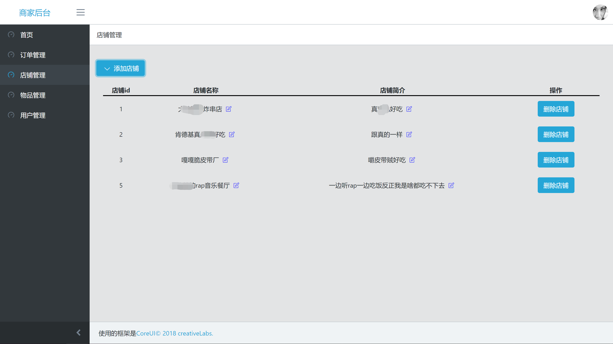

## 6.4 后台管理端前端页面与逻辑

后台管理端和App端使用完全不一样的前端架构，但是实现的业务逻辑都大同小异。所以我们需要使用另一套技术架构来实现这部分的需求。

后台管理端使用vue-cli工具开发，前端页面完全组件化。使用vue-cli + webpack + bable打包生成发布版代码，可以兼容全平台。

### 6.4.1 登录机制

和App端相似，通过登录接口获取到的登录凭证也需要保存到本地。浏览器环境下也有类似5+环境中的`plus.storage`，我们可以使用`localStorage`来保存这些内容。在登录页面的逻辑中可以看到

```vue
this.$ajax('account', {
	method: 'login',
	usr: this.username,
	pwd: this.password
}, function(res){
	console.log(res);
	if (res.code == 0) {
        for(var i in res.data){
            localStorage.setItem(i, res.data[i]);
        }

        window.location.hash = '/';
    } else {
    	alert(res.msg);
    }
});
```

这样的代码。这段代码将登录接口获取到的凭证存入了本地存储。

### 6.4.2 导航和路由

框架自带的导航功能可以满足当前项目的全部需求，在`/_nav.js`中导航是这样定义的

```javascript
export default {
  items: [
    {
      name: '首页',
      url: '/home',
      icon: 'icon-speedometer',
    },
    {
      name: '订单管理',
      url: '/order',
      icon: 'icon-speedometer',
    },
    {
      name: '店铺管理',
      url: '/shop',
      icon: 'icon-speedometer',
    },
    {
      name: '物品管理',
      url: '/goods',
      icon: 'icon-speedometer',
    },
    {
      name: '用户管理',
      url: '/user',
      icon: 'icon-speedometer',
    },
  ]
}
```

这样规定好了导航，在页面上会显示为


点击每个导航，页面会跳转到url规定的路由上。在vue项目中，路由不是普通的页面跳转，而是使用了url中的锚点功能。例如上面的首页对应的url是

```
http://host/#/home
```

我们知道，在url中的锚点以`#`分割，`#`后边是锚点值，通常用于与a标签配合使用，用于跳转到页面的指定位置。vue将这个特性封装成了路由，使用跳转到某个锚点的功能实现页面跳转。路由的具体原理不用深究，实现即可。

路由规定在`/router/index.js`文件中。

```javascript
import Vue from 'vue'
import Router from 'vue-router'

const  homepage = () => import('@/views/a/home.vue');
const order = () => import('@/views/a/order.vue');
const login = () => import('@/views/a/Login.vue');
const shop = () => import('@/views/a/shop.vue');
const goods = () => import('@/views/a/goods.vue');
const user = () => import('@/views/a/user.vue');
Vue.use(Router)

export default new Router({
    mode: 'hash', // https://router.vuejs.org/api/#mode
    linkActiveClass: 'open active',
    scrollBehavior: () => ({y: 0}),
    routes: [
        {
            path: '/',
            redirect: '/home',
            name: '',
            component: DefaultContainer,
            children: [
                {
                    path: 'home',
                    name: '首页',
                    component: homepage
                },
                {
                    path: 'shop',
                    name: '店铺管理',
                    component: shop,
                },
                {
                    path: 'order',
                    name: '订单管理',
                    component: order
                },
                {
                    path: 'goods',
                    name: '物品管理',
                    component: goods
                },
                {
                    path: 'user',
                    name: '用户管理',
                    component: user
                }
            ]
        },
        {
            path: '/login',
            name: '',
            component: login,

        }
    ]
})

```

用这个方式规定好了路由功能，在框架种还可以根据路由的`name`字段值来生成面包屑。例如


> 上图中顶部的“用户管理”就是面包屑，当产生层级关系时，面包屑还有跳转功能。

只有在路由中规定好的页面路径，点击导航时才会加载对应的vue模板。

### 6.4.3 订单管理

订单管理使用表格功能实现，vue模板是

```vue
<template>
    <div class="animated fadeIn">
        <b-row>
            <b-col>
                <table border="0" class="cTable">
                    <tr class="table-line1">
                        <th>订单id</th>
                        <th>物品</th>
                        <th>订餐人</th>
                        <th>价格</th>
                        <th>电话</th>
                        <th>地址</th>
                    </tr>
                    <tr v-for="(v,k) in list">
                        <td>v.id</td>
                        <td>{{v.goods[0].name}} 等</td>
                        <td>{{v.name}}</td>
                        <td><del>{{v.ori_price}}</del> / {{v.price}}</td>
                        <td>{{v.phone}}</td>
                        <td>{{v.addr}}</td>
                    </tr>
                </table>
            </b-col>
        </b-row>
    </div>
</template>
```

进入页面会加载订单列表，载入订单列表的接口访问逻辑是

```javascript
listShop() {
    this.$ajax('order', {
        method: 'orderList',
        token: window.localStorage.getItem('token')
    }, (res) => {
        console.log(res);
        if (res.code == 0) {
            this.list = [];
            for (var i in res.data) {
                this.list.push(res.data[i]);
            }
        } else {
            alert(res.msg);
        }
    });
}
```

加载好了数据会放在vue的data对象中，并循环渲染到页面上。页面加载完毕的效果是


### 6.4.4 店铺管理

进入店铺管理页面会加载店铺列表

```javascript
listShop() {
    this.$ajax('shop', {
        method: 'listShop',
        token: window.localStorage.getItem('token')
    }, (res) => {
        console.log(res);
        if (res.code == 0) {
            this.list = [];
            for (var i in res.data) {
                this.list.push(res.data[i]);
            }
        } else {
            alert(res.msg);
        }
    });
}
```

加载店铺列表的同时为每个字段绑定修改功能，并且提供对单条数据的操作功能。页面渲染部分的实现是

```vue
<b-row>
    <b-col>
        <table border="0" class="cTable">
            <tr class="table-line1">
                <th>店铺id</th>
                <th>店铺名称</th>
                <th>店铺简介</th>
                <th>操作</th>
            </tr>
            <tr v-for="(v,k) in list">
                <td>{{v.id}}</td>
                <td>{{v.name}} <i class="icon-note icons font-2xl d-block mt-4" @click="editShop(v.id,'name')"></i></td>
                <td>{{v.notice}} <i class="icon-note icons font-2xl d-block mt-4" @click="editShop(v.id,'notice')"></i></td>
                <td>
                    <b-button class="td-btn" variant="primary" @click="delShop(v)">删除店铺</b-button>
                </td>
            </tr>
        </table>
    </b-col>
</b-row>
```

在后台管理系统，提供添加店铺的功能。添加店铺时，我们引用了框架的`b-form`组件，来显示一个人性化的输入表单。


店铺管理页面加载完成的效果是



### 6.4.5 物品管理

物品管理和店铺管理的页面逻辑大同小异，也是获取列表再提供修改功能。实现效果是


后台管理系统提供添加物品的功能。添加物品时，所属店铺需要从已经存在的店铺列表中获取。


### 6.4.6 用户管理

用户管理页面会获取当前系统中存在的全部用户的列表，并且提供所有字段包括用户余额的修改权限。


