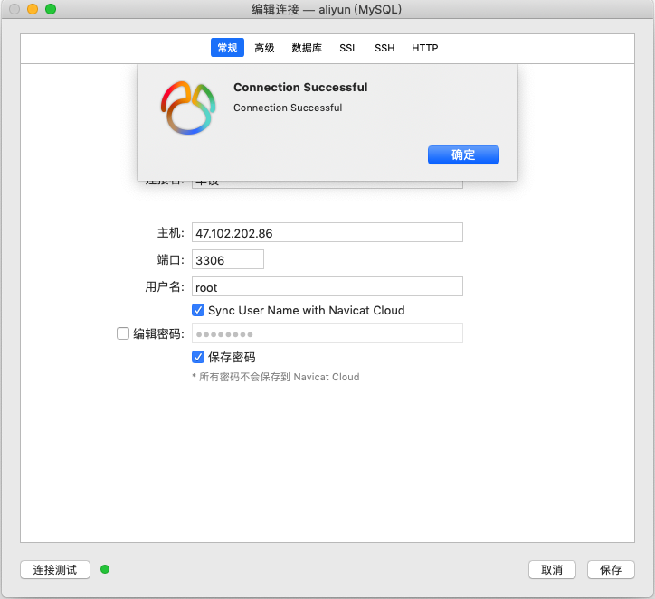

# 第4章 开发准备与开发前设计
## 4.1 搭建服务器环境
### 4.1.1 使用ssh登录服务器

购买了云主机后会得到一个公网ip，在系统终端下使用如下命令登录服务器。

```shell
$ ssh root@47.102.202.86
```

登录成功后会在终端显示如下提示信息。

```
$ ssh root@47.102.202.86
root@47.102.202.86's password: 
Last login: Wed May 22 15:04:07 2019 from 123.185.65.251

Welcome!
```

这说明当前终端已经是服务器的终端了。接下来我们要安装PHP、MySQL、Apache。

在CentOS系统下，默认的包管理工具是yum，我们本次设计的全部软件包都可以使用yum来下载安装。

### 4.1.2 安装Apache服务器程序

使用如下命令来安装Apache服务器程序。

```
$ yum install httpd
```

安装成功后，控制台会返回如下信息。

```
$ yum install httpd
已加载插件：fastestmirror
Loading mirror speeds from cached hostfile
 * webtatic: uk.repo.webtatic.com
正在解决依赖关系
--> 正在检查事务
---> 软件包 httpd.x86_64.0.2.4.6-89.el7.centos 将被 安装
--> 解决依赖关系完成

依赖关系解决

=============================================================================================================================================================
 Package                          架构                              版本                                            源                                  大小
=============================================================================================================================================================
正在安装:
 httpd                            x86_64                            2.4.6-89.el7.centos                             updates                            2.7 M

事务概要
=============================================================================================================================================================
安装  1 软件包

总下载量：2.7 M
安装大小：9.4 M
Is this ok [y/d/N]: y
Downloading packages:
httpd-2.4.6-89.el7.centos.x86_64.rpm                                                                                                  | 2.7 MB  00:00:00     
Running transaction check
Running transaction test
Transaction test succeeded
Running transaction
  正在安装    : httpd-2.4.6-89.el7.centos.x86_64                                                                                                         1/1 
  验证中      : httpd-2.4.6-89.el7.centos.x86_64                                                                                                         1/1 

已安装:
  httpd.x86_64 0:2.4.6-89.el7.centos                                                                                                                         

完毕！
```

安装成功后，使用如下命令启动Apache服务器。

```
$ service httpd start
```

控制台返回信息
```
Redirecting to /bin/systemctl start  httpd.service
```

经过很短的卡顿后，Apache服务器程序启动成功。使用浏览器直接访问服务器的ip地址，可以看到Apache的默认欢迎页。


至此，Apache安装成功。

### 4.1.3 安装PHP运行环境

使用如下命令来安装php运行环境。

```
$ yum install php70w
```

php70w是php 7.0软件包的名字，如果yum能找到这个软件包，就会为我们自动安装。如果系统中缺少相关依赖项，yum也会为我们自动找到并且安装。安装过程中会产生如下提示信息，我们可以从中看到一些依赖被自动安装了。

```
$ yum install php70w
已加载插件：fastestmirror
Loading mirror speeds from cached hostfile
 * webtatic: us-east.repo.webtatic.com
正在解决依赖关系
--> 正在检查事务
---> 软件包 php70w.x86_64.0.7.0.33-1.w7 将被 安装
--> 正在处理依赖关系 php70w-common(x86-64) = 7.0.33-1.w7，它被软件包 php70w-7.0.33-1.w7.x86_64 需要
--> 正在处理依赖关系 php70w-cli(x86-64) = 7.0.33-1.w7，它被软件包 php70w-7.0.33-1.w7.x86_64 需要
--> 正在处理依赖关系 php70w-cli = 7.0.33-1.w7，它被软件包 php70w-7.0.33-1.w7.x86_64 需要
--> 正在检查事务
---> 软件包 php70w-cli.x86_64.0.7.0.33-1.w7 将被 安装
---> 软件包 php70w-common.x86_64.0.7.0.33-1.w7 将被 安装
--> 解决依赖关系完成

依赖关系解决

=============================================================================================================================================================
 Package                                  架构                              版本                                   源                                   大小
=============================================================================================================================================================
正在安装:
 php70w                                   x86_64                            7.0.33-1.w7                            webtatic                            2.8 M
为依赖而安装:
 php70w-cli                               x86_64                            7.0.33-1.w7                            webtatic                            2.9 M
 php70w-common                            x86_64                            7.0.33-1.w7                            webtatic                            1.2 M

事务概要
=============================================================================================================================================================
安装  1 软件包 (+2 依赖软件包)

总下载量：6.9 M
安装大小：26 M
Is this ok [y/d/N]: y
Downloading packages:
(1/3): php70w-common-7.0.33-1.w7.x86_64.rpm                                                                                           | 1.2 MB  00:00:03     
(2/3): php70w-7.0.33-1.w7.x86_64.rpm                                                                                                  | 2.8 MB  00:00:03     
(3/3): php70w-cli-7.0.33-1.w7.x86_64.rpm                                                                                              | 2.9 MB  00:02:33     
-------------------------------------------------------------------------------------------------------------------------------------------------------------
总计                                                                                                                          46 kB/s | 6.9 MB  00:02:33     
Running transaction check
Running transaction test
Transaction test succeeded
Running transaction
  正在安装    : php70w-common-7.0.33-1.w7.x86_64                                                                                                         1/3 
  正在安装    : php70w-cli-7.0.33-1.w7.x86_64                                                                                                            2/3 
  正在安装    : php70w-7.0.33-1.w7.x86_64                                                                                                                3/3 
  验证中      : php70w-cli-7.0.33-1.w7.x86_64                                                                                                            1/3 
  验证中      : php70w-common-7.0.33-1.w7.x86_64                                                                                                         2/3 
  验证中      : php70w-7.0.33-1.w7.x86_64                                                                                                                3/3 

已安装:
  php70w.x86_64 0:7.0.33-1.w7                                                                                                                                

作为依赖被安装:
  php70w-cli.x86_64 0:7.0.33-1.w7                                             php70w-common.x86_64 0:7.0.33-1.w7                                            

完毕！

```

为了测试PHP是否安装成功，我们可以在控制台输入如下命令

```
$ php -v
```

来查看PHP的版本号。控制台返回信息是

```
$ php -v
PHP 7.0.33 (cli) (built: Dec  6 2018 22:30:44) ( NTS )
Copyright (c) 1997-2017 The PHP Group
Zend Engine v3.0.0, Copyright (c) 1998-2017 Zend Technologies
```

，说明PHP已经安装成功了。接下来我们前往Apache的网页目录，创建第一个PHP程序，查看一下PHP的信息。

```
$ cd /var/www/html/
$ vim phpinfo.php
```

在vim界面下按i进入插入模式，输入如下代码。

```php
<?php
echo phpinfo();
```

按Esc，按:wq保存并退出。在浏览器中访问http://47.102.202.86/phpinfo.php，可以看到PHP输出phpinfo的信息。


至此，php安装成功。

### 4.1.4 安装MySQL数据库程序

使用如下命令安装MySQL数据库。

```
$ sudo yum install mysql-server
```

要安装mysql-server，需要依赖mysql-community-client，在这次安装中会被同时安装。

控制台返回

```
$ sudo yum install mysql-server
已加载插件：fastestmirror
Loading mirror speeds from cached hostfile
 * webtatic: uk.repo.webtatic.com
正在解决依赖关系
--> 正在检查事务
---> 软件包 mysql-community-server.x86_64.0.5.7.26-1.el7 将被 安装
--> 正在处理依赖关系 mysql-community-client(x86-64) >= 5.7.9，它被软件包 mysql-community-server-5.7.26-1.el7.x86_64 需要
--> 正在检查事务
---> 软件包 mysql-community-client.x86_64.0.5.7.26-1.el7 将被 安装
--> 解决依赖关系完成

依赖关系解决

=============================================================================================================================================================
 Package                                      架构                         版本                                源                                       大小
=============================================================================================================================================================
正在安装:
 mysql-community-server                       x86_64                       5.7.26-1.el7                        mysql57-community                       166 M
为依赖而安装:
 mysql-community-client                       x86_64                       5.7.26-1.el7                        mysql57-community                        24 M

事务概要
=============================================================================================================================================================
安装  1 软件包 (+1 依赖软件包)

总下载量：190 M
安装大小：853 M
Is this ok [y/d/N]: y
Downloading packages:
(1/2): mysql-community-client-5.7.26-1.el7.x86_64.rpm                                                                                 |  24 MB  00:00:03     
(2/2): mysql-community-server-5.7.26-1.el7.x86_64.rpm                                                                                 | 166 MB  00:00:29     
-------------------------------------------------------------------------------------------------------------------------------------------------------------
总计                                                                                                                         6.4 MB/s | 190 MB  00:00:29     
Running transaction check
Running transaction test
Transaction test succeeded
Running transaction
  正在安装    : mysql-community-client-5.7.26-1.el7.x86_64                                                                                               1/2 
  正在安装    : mysql-community-server-5.7.26-1.el7.x86_64                                                                                               2/2 
  验证中      : mysql-community-server-5.7.26-1.el7.x86_64                                                                                               1/2 
  验证中      : mysql-community-client-5.7.26-1.el7.x86_64                                                                                               2/2 

已安装:
  mysql-community-server.x86_64 0:5.7.26-1.el7                                                                                                               

作为依赖被安装:
  mysql-community-client.x86_64 0:5.7.26-1.el7                                                                                                               

完毕！
```

，MySQL已经安装成功。接下来要对MySQL进行一定的配置。

刚安装好的MySQL是不允许直接登录的，如果尝试登录，会提示

```
$ mysql -u root
ERROR 2002 (HY000): Can't connect to local MySQL server through socket '/var/lib/mysql/mysql.sock' (2)
```

这样的错误信息。查阅了相关资料后，我们得知，第一次登录MySQL需要先配置MySQL跳过鉴权，然后配置好密码再取消跳过鉴权。

先找到MySQL的配置文件，使用vim编辑。

```
$ vim /etc/my.cnf
```

在mysqld节点下加入代码

```
skip-grant-tables
```

保存并退出，之后重启MySQL

```
$ service mysqld restart
Redirecting to /bin/systemctl restart  mysqld.service
```

然后使用命令
```
$ mysql
```

就可以直接进入到MySQL命令行下了。

```
$ mysql
Welcome to the MySQL monitor.  Commands end with ; or \g.
Your MySQL connection id is 2
Server version: 5.7.26 MySQL Community Server (GPL)

Copyright (c) 2000, 2019, Oracle and/or its affiliates. All rights reserved.

Oracle is a registered trademark of Oracle Corporation and/or its
affiliates. Other names may be trademarks of their respective
owners.

Type 'help;' or '\h' for help. Type '\c' to clear the current input statement.

mysql> 

```

在MySQL命令行下执行如下命令，来修改默认的密码。

```mysql
mysql> use mysql

mysql> update user set authentication_string=password('12312312344456') where user='root';
Query OK, 2 rows affected, 1 warning (0.00 sec)
Rows matched: 2  Changed: 2  Warnings: 1

mysql> FLUSH PRIVILEGES;
Query OK, 0 rows affected (0.00 sec)

mysql> exit
Bye
```

退出MySQL命令行之后，使用vim编辑/etc/my.cnf，在skip-grant-tables左边打一个#号，表示注释。在控制台重启MySQL程序。

```
service mysqld restart
```

重启成功后，使用命令连接MySQL数据库。

```
mysql -u root -p 
Enter password: 
Welcome to the MySQL monitor.  Commands end with ; or \g.
Your MySQL connection id is 8
Server version: 5.7.26 MySQL Community Server (GPL)

Copyright (c) 2000, 2019, Oracle and/or its affiliates. All rights reserved.

Oracle is a registered trademark of Oracle Corporation and/or its
affiliates. Other names may be trademarks of their respective
owners.

Type 'help;' or '\h' for help. Type '\c' to clear the current input statement.

mysql> 
```

MySQL数据库在控制台上连接成功。我们尝试一下使用Navicat进行远程连接。



远程连接成功。

至此，我们已经设置好了服务器的基础配置，接下来可以开始准备开发了。