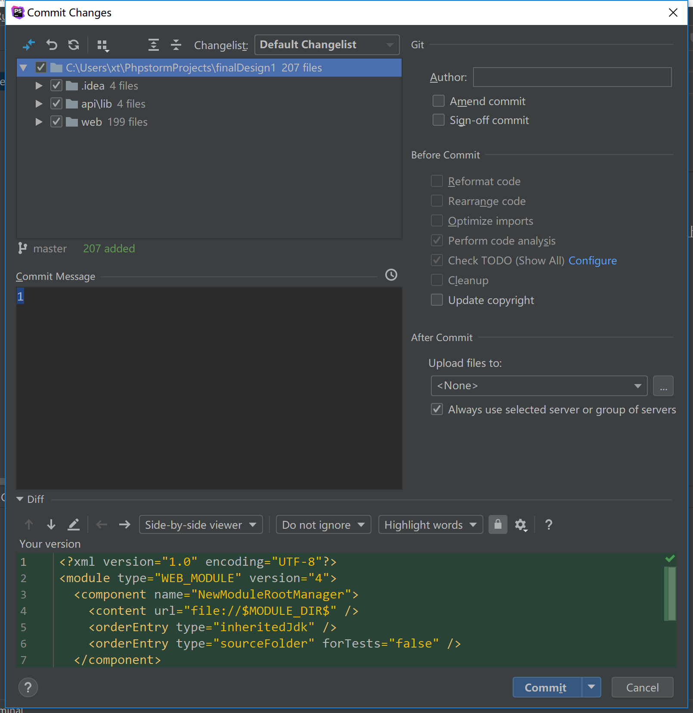

## 4.2 部署框架代码到服务器

### 4.2.1 创建github仓库

在部署代码之前，我们首先要确定代码部署方案。在设计阶段，我们决定使用github作为git的中转。在github上建立一个中转的repo，在本地push代码到github，服务器端定时从github上pull代码到本地。

首先我们前往github建立项目。建立项目的时候一定要特别注意的是，要将项目配置为私有。因为本次项目只是用github作为中转，并不想与其他人共享代码。


> 图：建立一个私有的github repo


建立成功后，我们在本地，使用Github Desktop将代码库clone下来。


将刚创建好的repo clone到本地后，我们编辑根目录的README.md，并使用phpstorm自带的git插件将文件push到github上。


push成功后，打开github网页，刷新页面，可以看到更新结果。


### 4.2.2 配置服务器git环境

接下来前往服务器，做接下来的事情。由于新安装的服务器没有git功能，所以我们需要先安装git工具。在ssh下连接服务器，执行以下命令来安装git。


```shell
$ yum install git
```


执行成功后，控制台会返回如下的信息。


```shell
$ yum install git
Loaded plugins: fastestmirror
Loading mirror speeds from cached hostfile
 * webtatic: uk.repo.webtatic.com
Resolving Dependencies
--> Running transaction check
---> Package git.x86_64 0:1.8.3.1-20.el7 will be installed
--> Processing Dependency: perl-Git = 1.8.3.1-20.el7 for package: git-1.8.3.1-20.el7.x86_64
--> Processing Dependency: rsync for package: git-1.8.3.1-20.el7.x86_64
--> Processing Dependency: perl(Term::ReadKey) for package: git-1.8.3.1-20.el7.x86_64
--> Processing Dependency: perl(Git) for package: git-1.8.3.1-20.el7.x86_64
--> Processing Dependency: perl(Error) for package: git-1.8.3.1-20.el7.x86_64
--> Running transaction check
---> Package perl-Error.noarch 1:0.17020-2.el7 will be installed
---> Package perl-Git.noarch 0:1.8.3.1-20.el7 will be installed
---> Package perl-TermReadKey.x86_64 0:2.30-20.el7 will be installed
---> Package rsync.x86_64 0:3.1.2-6.el7_6.1 will be installed
--> Finished Dependency Resolution

Dependencies Resolved

============================================================================================================================================================================================== Package                                           Arch                                    Version                                             Repository                                Size
==============================================================================================================================================================================================Installing:
 git                                               x86_64                                  1.8.3.1-20.el7                                      updates                                  4.4 M
Installing for dependencies:
 perl-Error                                        noarch                                  1:0.17020-2.el7                                     base                                      32 k
 perl-Git                                          noarch                                  1.8.3.1-20.el7                                      updates                                   55 k
 perl-TermReadKey                                  x86_64                                  2.30-20.el7                                         base                                      31 k
 rsync                                             x86_64                                  3.1.2-6.el7_6.1                                     updates                                  404 k

Transaction Summary
==============================================================================================================================================================================================Install  1 Package (+4 Dependent packages)

Total download size: 4.9 M
Installed size: 23 M
Is this ok [y/d/N]: y
Downloading packages:
(1/5): perl-Git-1.8.3.1-20.el7.noarch.rpm                                                                                                                              |  55 kB  00:00:00
(2/5): perl-TermReadKey-2.30-20.el7.x86_64.rpm                                                                                                                         |  31 kB  00:00:00
(3/5): perl-Error-0.17020-2.el7.noarch.rpm                                                                                                                             |  32 kB  00:00:00
(4/5): rsync-3.1.2-6.el7_6.1.x86_64.rpm                                                                                                                                | 404 kB  00:00:00
(5/5): git-1.8.3.1-20.el7.x86_64.rpm                                                                                                                                   | 4.4 MB  00:00:00
----------------------------------------------------------------------------------------------------------------------------------------------------------------------------------------------Total                                                                                                                                                          14 MB/s | 4.9 MB  00:00:00
Running transaction check
Running transaction test
Transaction test succeeded
Running transaction
  Installing : 1:perl-Error-0.17020-2.el7.noarch                                                                                                                                          1/5
  Installing : rsync-3.1.2-6.el7_6.1.x86_64                                                                                                                                               2/5
  Installing : perl-TermReadKey-2.30-20.el7.x86_64                                                                                                                                        3/5
  Installing : git-1.8.3.1-20.el7.x86_64                                                                                                                                                  4/5
  Installing : perl-Git-1.8.3.1-20.el7.noarch                                                                                                                                             5/5
  Verifying  : perl-Git-1.8.3.1-20.el7.noarch                                                                                                                                             1/5
  Verifying  : 1:perl-Error-0.17020-2.el7.noarch                                                                                                                                          2/5
  Verifying  : perl-TermReadKey-2.30-20.el7.x86_64                                                                                                                                        3/5
  Verifying  : git-1.8.3.1-20.el7.x86_64                                                                                                                                                  4/5
  Verifying  : rsync-3.1.2-6.el7_6.1.x86_64                                                                                                                                               5/5

Installed:
  git.x86_64 0:1.8.3.1-20.el7

Dependency Installed:
  perl-Error.noarch 1:0.17020-2.el7              perl-Git.noarch 0:1.8.3.1-20.el7              perl-TermReadKey.x86_64 0:2.30-20.el7              rsync.x86_64 0:3.1.2-6.el7_6.1

Complete!
```


在服务器上安装git成功后，我们手动将刚创建好的repo clone下来。


```shell
$ git clone https://github.com/xtzero/finalDesign1.git
```


### 4.2.3 使用shell脚本让服务器的代码可以自动更新

clone成功后，在服务器上我们编辑这样两个shell脚本。


for.sh

```shell
#!/bin/bash
for((i=0;i==0;i=i+0))
do
        sleep 5s
        ~/git.sh;
done
```


git.sh

```shell
#!/bin/bash

cd /var/www/html/xtBlog/ && git pull
```

第一个脚本是每隔5秒就调用第二个脚本，第二个脚本的作用是从github上拉取最新的代码。

然后我们在控制台上执行这样一个命令


```shell
nohup ./for.sh &
```


这样服务器就会每5秒从github上pull一次最新的代码。在后面的开发中，我们只需要在本地将代码push到github上，稍等5秒就可以刷新页面看到最新的运行结果了。


### 4.2.4 将框架代码部署到服务器

我们将准备好的初始代码复制到github项目文件夹下，使用phpstorm自带的git功能将文件push到服务器上。




上传成功后，前往服务器的git目录下，可以看到文件已经存在于服务器目录下了。


至此，我们已经将初始代码全部部署到服务器上。下一步的工作就是为服务器绑定域名，然后开始功能上的开发。